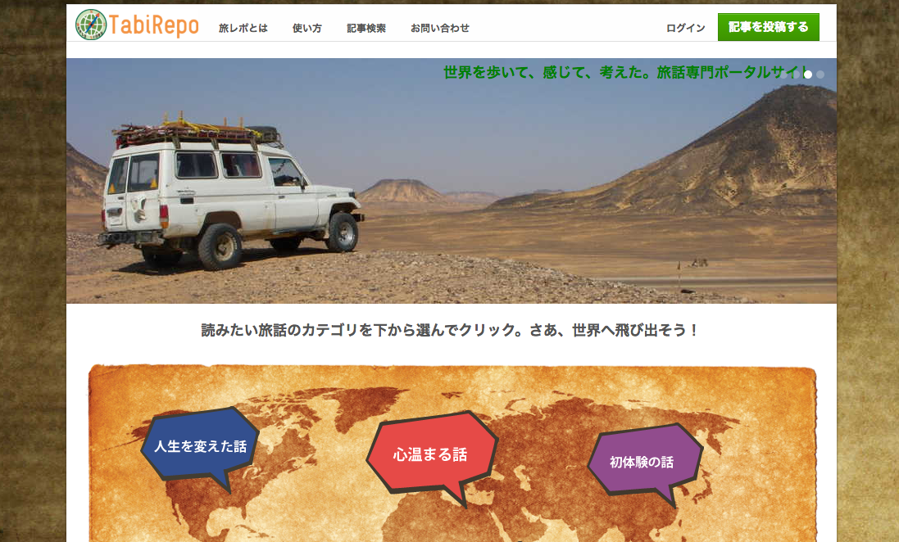

旅レポ: TabiRepo
=============

[旅レポ: TabiRepo](https://tabirepo.herokuapp.com/)

## Description
This was an unsuccessful web media launched in 2013 and is in the end of service.

## Demo
https://tabirepo.herokuapp.com/

## Requirement
### Database

- SQLite 3 or MySQL 5.5+

### Ruby on Rails
- Ruby on Rails 3.2
- Ruby Version 1.9+

### Web Browser

- Firefox - Latest Version
- Chrome - Latest Version
- Safari - Latest Version
- Internet Explorer - IE 9+

## Install
### Gems
- bundle install --path vendor/bundle

### DB load
- bundle exec rake db:create
- bundle exec rake db:schema:load
- bundle exec rake db:migrate
- bundle exec rake db:seed

### Start Rails App 
- bundle exec rails s

## Licence

[MIT](https://opensource.org/licenses/MIT)

## Author

[tomosm](https://github.com/tomosm)
